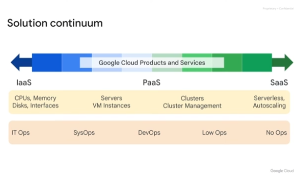

<h1>Introduction</h1>
<h2>Google Cloud Platform(GCP)</h2>
<h3>Google Cloud Ecosystem</h3>

* Open source software
* Providers
* Developers
* Partners
* Other cloud providers
* Third-party software

<h3>Google Cloud</h3>

* Chrome
* Google devices
* Google Maps
* Google Analytics
* Gmail
* Google Search
* Google Workspace (previously G Suite)

<h2>Solution Continuum</h2>

**Infrastructure** is the basic underlying framework of fundamental facilities and systems. Everything that goes into creating and supporting applications for the users is the infrastructure.

<h2>Googles compute services</h2>
<h3>Compute Engine</h3>

* Virtual machines on demand in the Cloud
* IaaS 
* maximum flexibility for those who prefer to manage server instances themselves.

<h3>Google Kubernetes Engine</h3>

* Containerized applications that Google manages for you
* A way to package code that is designed to be highly portable and use resources very efficiently. 
* Kubernetes orchestrates code in containers.

<h3>App Engine</h3>

* Fully managed PaaS
* Run code in the Cloud without having to worry about infrastructure

<h3>Cloud Functions</h3>

* Serverless execution environment
* Functions as a Service
* Executes your code in response to events

<h3>Cloud Run</h3>

* Managed compute platform running stateless containers via web requests or Pub/Sub events
* Serverless
* Built on Knative giving freedom to move workloads across different environments and platforms, fully managed on Google Cloud
* Is fast, as it can scale up and down almost instantaneously and only charged for what you use

<h2>Architecting with Google Compute Engine Series</h2>
<h3>Essential Cloud Infrastructure: Foundation</h3>

* Introduction to Google Cloud
* Virtual Networks
* Virtual Machines

<h3>Essential Cloud Infrastructure: Core Services</h3>

* Identity and Access Management (IAM)
* Data Storage Services
* Resource Management
* Resource Monitoring

<h3>Elastic Google Cloud Infrastructure: Scaling and Automation</h3>

* Interconnecting Networks
* Load Balancing and Autoscaling
* Infrastructure Automation
* Managed Services

