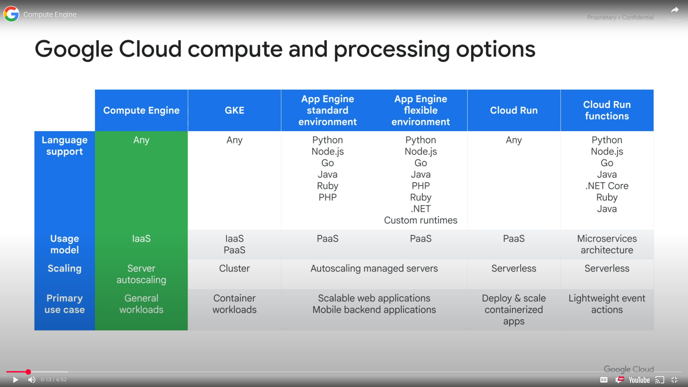
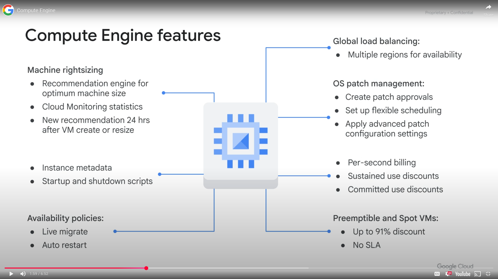
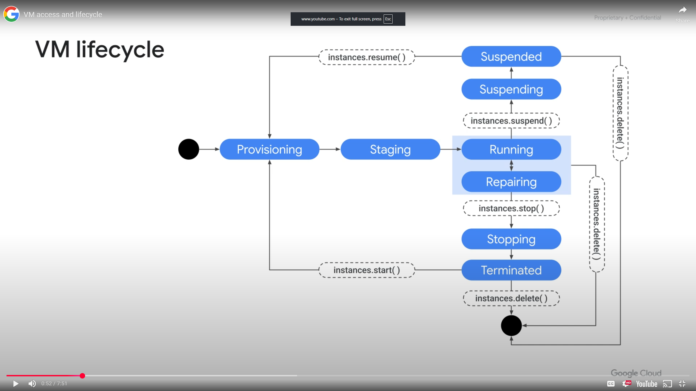
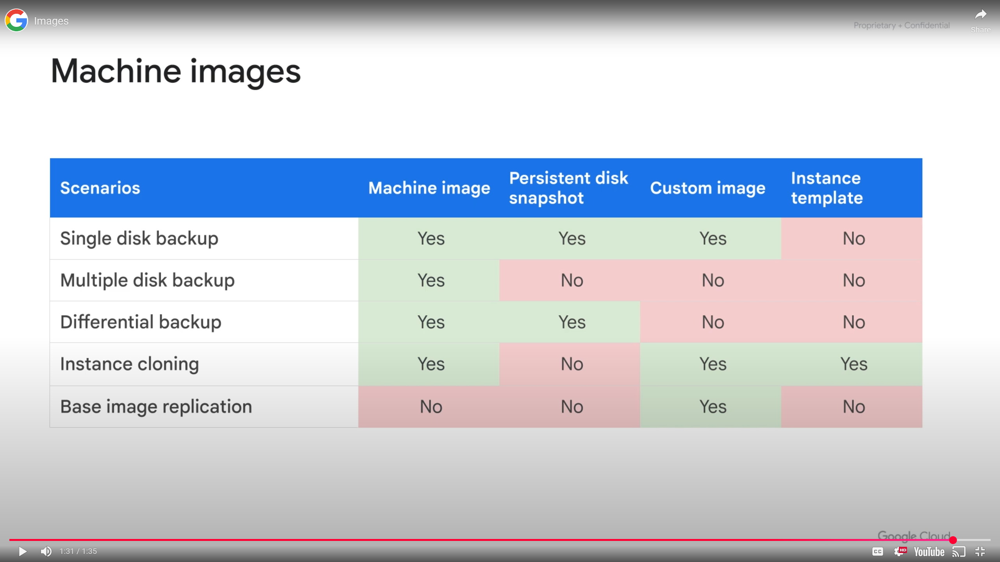
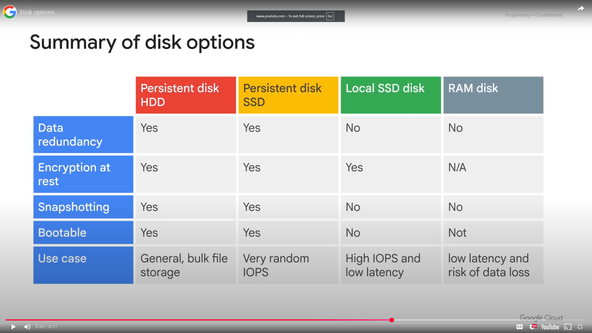

<h1>Virtual Machines</h1>
<h2>Module Overview</h2>

* Virtual Machines (VMs) are similar to a hardware computer. They consist of a virtual CPU, memory, disk storage and an IP address
* Compute Engine is the service that creates VMs. It is flexible and offers many options. Eg: micro VM sharing CPU with other VMs, VMs with burst capability
* Main options are CPU, memory, discs and networking

Modules:

* Compute Engine
  * Lab - creating Virtual MAchines
* Compute Options (vCPU and Memory)
* Images
* Disk Options
* Common Compute Engine Actions
  * Lab - Working with Virtual Machines

<h2>Compute Engine</h2>

<h3>Google Cloud Compute and Processing Options</h3>

* Compute Engine gives the most flexibility. IaaS. You have a VM and and operating system to manage how it handles aspects such as autoscaling and rules
* Compute Engine is physical servers running inside the Google Cloud environment with predefined or custom configuration machine types
  * vCPU (cores) and memory (RAM)
  * Storage
    * Zonal or regional persistent disk(HDD or SSD)
    * Local SSD
    * Cloud Storage
  * Networking interfaces
  * Linux or Windows

<h3>Tensor Processing Unit(TPU)</h3>

Due to hardware manufacturers hitting limitations in CPU and GPU not meeting demands for machine learning, Google introduced Tensor Processing Unit. Custom developed application specific integrated circuits used to accelerate machine learning workloads. They act as domain specific hardware allowing for higher efficiency by tailoring architecture to meet computation needs in a domain. Generally faster and significantly more energy efficient. Recommended for models that train for long durations or large models with large effective batch sizes.

<h3>Compute</h3>

Several machine types

* Network throughput scales 2 Gbps per vCPU
* Theoretical max of 200 Gbps with 176vCPU. A vCPU is equal to 1 hardware hyper thread

<h3>Storage</h3>

Disks
* Standard, SSD or Local SSD (std, non local up to 257TB per instance)
* Standard and SSD PDs scale in performance for each GB of space allocated
* Resize disks or migrate instances with no downtime

*SSDs* are designed to give you a higher number of IOPS per dollar vs *standard disks*, which give a higher amount of capacity per dollar. *Local SSDs* have a higher throughput and lower latency than SSD persistent disks as they are attached to the physical hardware. However data only persists until you stop or delete the instance

<h3>Networking</h3>

Robust networking features
* Auto, custom networks
* Inbound/outbound firewall rules
  * IP based
  * Instance/group tags
* Application Load Balancing
* Network Load Balancing
  * Does not require pre warming
* Global and multi region subnetworks

<h2>Demo: Create a VM</h2>

A walkthrough of the VM creation process, pointing out CPU, storage, network options in the GCP console

<h2>VM Access and Lifecycle</h2>

<h3>VM Access</h3>
<h4>Linux:SSH</h4>

* SSH from the Google Cloud Console or Cloud Shell via the Google Cloud SDK
* SSH from computer or third party client and generate key pair
* Requires firewall rule to all tcp:22

<h4>Windows: RDP</h4>

* RDP client
* Powershell terminal
* Requires setting the Windows password
* Requires firewall rule to all tcp:3389

<h3>VM Lifecycle</h3>

**Provisioning** defining the properties of an instance. Resources like CPU, memory and disk are being reserved for the instance, but its not up and running yet.

**Staging** Resources have been acquired and instance is prepared for launch.  Compute Engine is adding IP addresses, booting up the system image, and system.

**Running**  Goes through pre-configured startup scripts and enable SSH or RDP access. Actions you can perform for example: live migrate your VM to another host in the same zone, take snapshots of the persistent disk, export the system image, reconfigure metadata.

**Stopping** Goes through pre-configured shutdown scripts and end in the terminated state.

**Terminated** A stopped VM, with options to restart the instance, delete, reset or modify it. Reset will wipe the memory contents.

**Repairing** When a VM encounters an internal error or the underlying machine is unavailable due to maintenance. Not usable or billable. Not covered by the Service Level Agreement.

**Suspending/Suspended** When you suspend a VM it enters the suspending state before being suspended. Can be then resumed or deleted.

<h3>VM State Commands</h3>

`reset` console, gcloud,API, OS ~0sec running

`start` console, gcloud, API ~0sec terminated -> running

`reboot` OS: `sudo reboot` ~90sec running -> running

`stop` console, gcloud, API ~90sec running -> terminated

`shutdown` OS: `sudo shutdown` ~90sec running -> terminated

`delete` console, gcloud, API ~90sec running -> N/A

`preemption` automatic ~30 sec N/A

<h3>Availability Policy</h3>

The policy(scheduling options in SDK/API) determines how a VM will behave when the Compute Engine migrates to another host. Options as follows:

**Automatic restart** Automatic VM restart due to crash or maintenance event, not preemption or a user-initiated terminate.

**On host maintenance** Determines if host is live migrated or terminated due to a maintenance event, live migration is the default.

**Live migration** During maintenance event VM is migrated to different hardware without interruption, metadata indicates occurrence of live migration.

<h3>Patch Management</h3>

* Keep infrastructure up to date
* Reduce the risk of security vulnerabilities
* OS patch management service covers
  * Patch compliance reporting across Windows and Linux
  * Patch deployment schedules patch jobs

* Create patch approvals
* Set up flexible scheduling
* Apply advanced patch configuration settings
* Manage these patch jobs or updates from a centralized location

<h3>Stopped/Terminated VMs</h3>
Do not pay for memory or CPU resources, but you are charged for any attached disks and reserved IP addresses.

Actions while terminated:

* Change the machine type
* Migrate the VM instance to another network
* Add or remove attached disks, change auto-delete settings
* Modify instance tags
* Modify custom VM or project-wide metadata
* Remove or set a new static IP
* Modify VM availability policy
* CANNOT change the image of a stopped VM

<h2>Creating Virtual Machines</h2>
<h3>Intro</h3>
Explore Virtual Machine instance options by creating several standard VMs and a custom VM, connecting to them using both SSH for LInux and RDP for Windows.

<h3>Review</h3>

Start with smaller VMs when you are prototyping solutions to keep costs down, when you are ready for production, trade up to larger VMs based on capacity. If your building in redundancy for availability, allocate excess capacity to meet performance requirements.

<h2>Compute Options</h2>

<h3>Creating a VM</h3>

* Google Cloud Console
* CLI `gcloud compute instance create [instance name]`
* REST API
 
VM creation options

* Project
* Region
* Zone
* Subnetwork
* Machine Type
* Disk options
* Image
* IP options

<h3>Machine Type</h3>

**Machine family** a curated set of processor and hardware configurations optimized for specific workloads.

**Machine series** further organized into series

**Machine type** determines the resources available

<h3>Machine Families</h3>

<h4>General Purpose</h4>

Best price performance, most flexible vCPU to memory ratios, targets most standard and cloud native workloads

**E2** Cost optimized, day to day computing at a lower cost when paired with committed use discount, 2-32vCPU, 0.5-8GB RAM, option of shared core machine types

* Web serving
* App serving
* Back office apps
* Small-medium databases
* Microservices
* Virtual desktops
* Development environments

**N2, N2D, N1** flexible, balance between price and performance, committed use and sustained uses discounts, scalable up to 128 vCPU, 0.5-8GB RAM

* Web serving
* App serving
* Back office apps
* Medium-large databases
* Cache
* Media/streaming

**Tay T2D, Tau T2A** Scale out optimized, best performance/cost for demanding workloads, full x86 compatibility, 60vCPU, 4GB RAM, ARM processors

* Scaleout workloads
* Web serving
* Containerized microservices
* Media transcoding
* Large scale Java applications

<h4>Compute Optimized</h4>

Highest performance per core, optimized for compute intensive workloads

**C2** Ultra high performance, up to 3.8Ghz, 4-60vCPU, up to 240Gb RAM, can attach 3TB local storage

* Compute bound workloads
* High performance web serving
* Gaming (AAA game servers)
* Ad serving
* High performance computing (HPC)
* Media transcoding
* AI/ML

**C2D** ultra high performance, largest VM sizes and cache per core, 2-112 vCPU, 4GB RAM, 3TB local storage

* Memory bound workloads
* Gaming (AAA game servers)
* High performance computing (HPC)
* High performance databases
* Electronic Design Automation (EDA)
* Media transcoding

**H3** ultra high performance, 88 cores, 352 GB of DDR5 memory, Intel Sapphire Rapids CPU/Intel Infrastructure Processing Unit, higher memory to vCPU ratios.

* High performance computing (HPC)
* Electronic Design Automation (EDA)

<h4>Memory Optimized</h4>

Ultra high memory workloads, lowest cost per GB of memory, up to 30% sustained use discounts, committed use discounts

**M1** up to 4TB RAM

* Medium in memory databases SAP HANA
* Tasks requiring intensive use of memory with higher memory to vCPU ratios than the general purpose high memory types
* In memory databases, analytics, business warehousing workloads, genomics analysis, SQL analysis
* SQL server

**M2** up to 12TB RAM

* Large in memory databases SAP HANA
* In memory databases, analytics, business warehousing workloads, genomics analysis, SQL analysis

**M3** up to 128 v CPU, 30.5 RAM

* OLAP and OTLP SAP workloads
* Memory Intense Electronic Design Automation

<h4>Accelerator Optimized</h4>

Ideal for massively parallelized Compute Unified Device Architecture compute workloads. ML and AI, GPU

**A2** 12-96 vCPU, up to 1360GB RAM, has NVIDIA Ampere A100 GPU attached(40GB)

* CUDA enable ML training and inference
* HPC
* Massive parallelized computation

**G2** 4-96 vCPU, up to 432GB RAM, Intel Cascade Lake CPU

* Video transcoding
* Remote visualization workstation

<h4>Custom machine type</h4>

* requirements fit between predefined  types
* Need more memory or CPU
* Either 1 vCPU or even number
* Up to 8GB per vCPU
* Total memory must be multiple of 256MB
* Costs slightly more
* Extended memory available at a cost

<h2>Compute Pricing</h2>

* Per second billing, minimum or 1 minute
  * vCPU, GPU, GB of memory
* Resource based pricing
  * Each vCPU and GB of memory is billed separately
* Discounts cannot be combined
  * Sustained use
  * Committed use (1 or 3 years)
  * Preemptible VM instances (24h at a time)
* Recommendation Engine
  * notifies you of underutilized instances
* Free usage limits

<h3>Sustained Use Discounts</h3>
Depending on the percentage of use over the month depends on the discount given up to 30% for instances running an entire month.

Compute Engine calculates sustained use discounts based on vCPU and memory usage across each region and separately for each of the following categories: Predefined machine types and custom machine types.

<h2>Special Compute Configurations</h2>

<h3>Preemptible</h3>

* Lower price for interruptible service (up to 91%)
* VM may be terminated at any time
  * No charge if terminated in the first minute
  * 24 hours max
  * 30 second terminate warning, but not guaranteed. Time for shut down script
* No live migrate, no auto restart
* Can request that CPU quota for a region be split between regular and preemption
  * Default preemptible VMs counts against region CPU quota
* Ideal for batch processing

<h3>Spot VMs</h3>

* Latest version of preemptible VMs
* Share the same pricing model as preemptible VMs
* No minimum or maximum runtime
* Are finite Compute Engine resources, so might not always be available
* No live migrate or auto restart
* Best practice use cases: come from excess and back up cloud capacity, smaller machine types are easier to acquire

<h3> Sole Tenant Nodes</h3>

A physical Compute Engine server, dedicated to hosting VM instances only for your specific use. For workloads that require physical isolation from other workloads or virtual machines to meet compliance requirements. Can bring over existing operating system licenses.

<h3>Shielded VMs</h3>
Offer verifiable integrity, requires a shielded image.

* Secure Boot
* Virtual trusted platform mode (vTPM)
* Integrity monitoring

<h3>Confidential VMs</h3>

* Encrypts data while it's being processed
* Easy to use with no changes to code or performance compromise
* N2D Compute Engine VM running on second generation AMD Epyc processors
* Provides high memory capacity, high throughput, and supports parallel and compute heavy workloads

<h2>Images</h2>

When creating a VM you can choose teh boot disk image. The image includes

* Boot loader
* Operating system
* File system structure
* Software
* Customizations

<h3>Public Based Images</h3>

* Google, third part vendors and community, premium
* Linux - CentOS, Core OS, Debian, RHEL, SUSE, Ubuntu, openSUSE and FreeBSD
* Windows - Windows server 2019, 2016, 2012,
SQL server preinstalled on Windows

<h3>Custom Images</h3>

* Create new image from VM: preconfigured and installed SW
* Import from on-prem, workstation or another cloud
* Management features: image sharing, image family, deprecation

<h2>Disk Options</h2>

<h3>Boot Disk</h3>

* VM comes with a single root persistent disk
* Image is loaded onto root disk during first boot
  * Bootable: can attach ato a VM and boot from it
  * Durable: can survive VM terminate
* Some OS images are customized for Compute Engine
* Can survive VM deletion if "Delete boot disk when instance is deleted" is disabled

<h3>Persistent Disk</h3>

* Attached to a VM through the network interface
* Durable storage, can survive VM terminate
* Bootable, can attach to VM and boot from it
* Snapshots, incremental backups
* Performance scales with size
* HDD or SSD options
* Disk resizing, while running and attached
* Can attached in read only mode to multiple VMs
* Zonal or Regional
  * pd-standard - large data processing
  * pd-ssd - enterprise applications, high performance databases with lower latency
  * pd-balanced - balance between cost and performance
  * pd-extreme (zonal only) - high end databases
* Encryption keys
  * Google managed
  * Customer managed
  * Customer supplied

<h3>Local SSD</h3>

* SSD are physically attached to a VM
* More IOPS, lower latency, higher throughput than persistent disk
* 375GB disk up to 24, total of 9TB per instance
* Data survives a reset, but not a VM stop or terminate
* VM specific, cannot be attached to a different VM

<h3>RAM Disk</h3>

* tmpfs to store data in memory
* Faster than local disk, slower than memory
  * Use when your application expects a file system structure and cannot directly store its data in memory
  * Fast scratch disk, or fast cache
* Very volatile, erase on stop or restart
* May need a larger machine type if RAM was sized for the application
* Consider using a persistent disk to back up RAM disk data

Limit of disks attached to a VM. If they are shared core a maximum of 16, otherwise maximum of 128.

<h3>Cloud Persistent Disk</h3>

* Single file system is best
* Resize disks
* Resize file system
* Built in snapshot service
* Automatic encryption

<h2>Common Compute Engine Actions</h2>

<h3>Metadata and Scripts</h3>

Every VM stores its metadata on a metadata server, including the startup and shut down scripts. You can use teh metadata server to programmatically get unique information about an instance without additional authorization.

<h3>Moving Instances to a New Zone ot Region</h3>

 This may happen for geographical reasons or because a zone is being deprecated. 

 To move a VM

 * Shut the VM down
 * Move it to the destination zone or region
 * Restart the VM
 * Update any references to the original source

<h3>Snapshots</h3>

Snapshots can be used to back up critical data into a durable storage solution to meet application, availability and recovery requirements. Snapshots are stored in Cloud Storage.

* Used to migrate data from one zone to another
* Transfer data to a different disk type

<h4>Persistent Disk Snapshots</h4>

* Snapshots is not available for local SSD
* Creates an *incremental* backup to Cloud Storage, so not visible in your buckets as its managed by the snapshot service
* Create scheduled snapshots, regular, automatically back up zonal and regional persistent disks
* Snapshots can be restored to a new persistent disk
  * New disk can be in another region or zone in the same project
  * Basis of VM migration, but does not back up VM metadata, tags etc

<h3>Resize Persistent Disk</h3>

Increasing disk capacity is to improveI/O performance, can be done while running but can never shrink disk size.

<h2>Working with Virtual Machines</h2>
<h3>Intro</h3>

Setting up an application server. Configure the VM, add capacity for a production gaming system, build infrastructure for production activities, including backups and shutdown and restart services.

<h3>Review</h3>

Customized a VM instance by installing base software which was a headless JAVA runtime environment and application software (Minecraft server). Customized the VM by 

* Attaching a high speed SSH
* Reserved a static external IP address
* Verified the availability of the gaming server online
* Setup automated backups using cron
* Set up maintenance scripts using metadata for graceful startup and shutdown of the server
