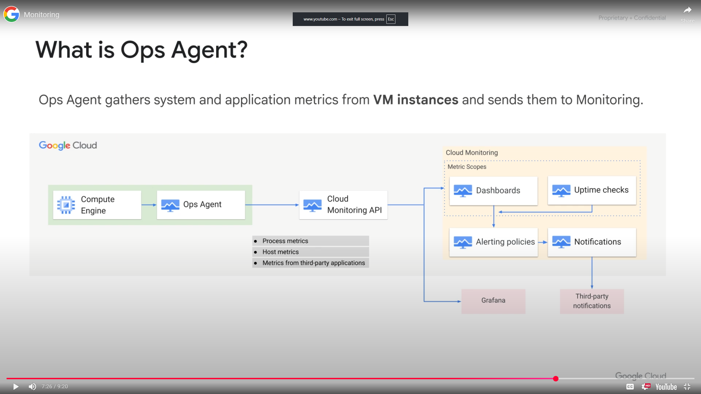
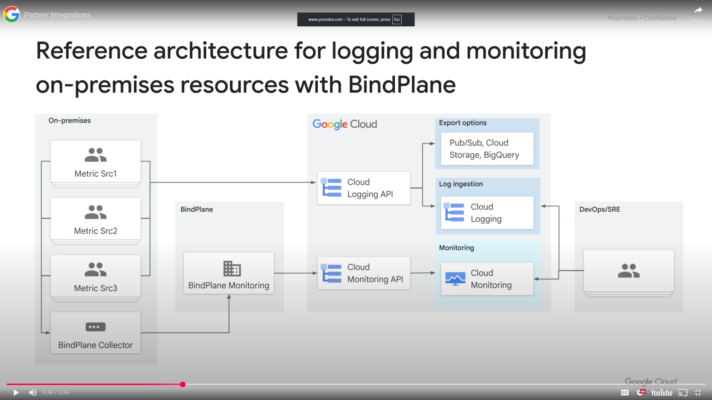

<h1>Resource Monitoring</h1>

<h2>Module Overview</h2>

* Google Cloud Observability
* Monitoring
* Logging
* Error Reporting
* Tracing
* Profiling
* Partner Integrations

<h2>Google Cloud Observability Overview</h2>

Google Cloud Observability dynamically discovers cloud resources and application services based on deep integration with Google Cloud and Amazon Web Services.
* Integrated monitoring, logging, diagnostics, error reporting, tracing, profiler
* Manages across platforms
  * Google Cloud and AWS
  * Dynamic discovery of Google Cloud with smart defaults
  * Open source agents and integrations
* Access to powerful data and analytic tool
* Collaboration with third party software
* Pay only for what you use, free usage allotments

<h2>Monitoring</h2>

Monitoring is important as it is at the base of site reliability engineering, a discipline that applies aspects of software engineering to operations whose goals are to create ultra scalable and highly reliable software systems. It includes the following
* Incident Response
* Postmortem/Root Cause Analysis
Testing and Release Procedures
* Capacity Planning
* Development
* Product

**Monitoring** includes
* Dynamic congfig and intelligent defaults
* Platform, system, and application metrics
  * Ingests data: Metrics, events, metadata
  * Generates insights through dashboards, charts, alerts
* Uptime/health checks
* Dashboards
* Alerts

<h3>Metric Scope</h3>
 
 Is the root entity that holds monitoring and configuration information in Cloud Monitoring. It can access metric data from its monitored projects but the metric data and log entries remain in the individual projects
* Each metric scope can have 1-375 monitored projects
* Contains:
  * Custom dashboards
  * Alerting policies
  * Uptime checks
  * Notification channels
  * Group definitions used
* Determine your monitoring needs up front
* Consider using separate metrics scopes for data and control isolation, control visibility to data

**Scoping Project** is the first monitored Google Cloud project and must be specified when creating the metric scope. The name of the project becomes the name of the metric scope.

**NOTE:** to add a AWS account you must configure a project in Google Cloud to hold the AWS Connector.

<h3>Dashboards</h3>

Can create custom dashboards that contain charts of the metrics you want to monitor, providing visibility into the utilization and network traffic of your VM instances. Charts can be customized with:
* Filters to remove noise
* Groups to reduce teh number of time series
* Aggregates to group multiple time series together

<h3>Alerting Policies</h3>

Notifications when specific conditions are met in order to troubleshoot issues. You can also create an alerting policy that monitors your usage of Google Cloud Observability and alerts you when you approach the threshold for billing.
* Conditions
* Notifications
* Documentation
* Name of Policy

Best practices for alerts
* Alerting on symptoms and not necessarily causes. Eg monitor failing queries of a database then identify if the database is down
* Use multiple notification channels eg email and SMS to avoid a single point of failure in your alerting strategy
* Customize alerts to the audiences needs by describing what actions need to be taken or what resources need to be examined
* Avoid noise as it will cause alerts to be dismissed over time, so adjust monitoring alerts so that they are actionable and don't just set up alerts on everything.
* In documentation section, document what happened, why whoever is getting notified is being alerted and explain how to fix it

<h3>Uptime Checks</h3>

Configured to test the availability of your public services from locations around the world. Can be set to HTTP, HTTPS or TCP. Resources checked can be App Engine application, Compute Engine instance, URL of a host, AWS instance or load balancer. For each uptime check, you can create an alerting policy and view the latency of each global location.

<h3>Ops Agent</h3>

WIth Compute Engine instances, because the VMs are running on Google hardware, the hypervisor cannot access some of the internal metrics inside a VM. Ops Agent collects metrics inside of VMs not at the hypervisor level. It is the primary agent for collecting telemetry data from your instances. Supports most major operating systems

The collected metrics is then used by Cloud Monitoring to create dashboards, alerts, uptime checks and notifications.

<h3>Custom Metrics</h3>

If standard metrics provided by Cloud Monitoring do not fit yur needs, you can create custom metrics. Think about what metric indicator you might use to trigger events.

<h3>Autoscaler</h3>

Autoscale to maintain a metric at a target value. TO maintain a metric at a target value, specify a utilization target
* If the metric comes from each VM in your managed instance group (MIG) -> the average metric value across all VMs is compared with the utilization target
* If the metric applies to the the whole MIG and does not come from the VMs in your MIG -> the metric value is compared with the utilization target
* If your metric has multiple values -> apply a filter to autoscale using an individual value from the metric

<h2>Resource Monitoring</h2>
<h3>Intro</h3>

How to use Cloud Monitoring to gain insight into applications that run on Google Cloud.
* Enable Cloud Monitoring
* Add charts to dashboards
* Create alerts, resource groups and uptime checks

<h3>Review</h3>

Monitoring is critical to your applications health and Cloud Monitoring provides a rich set of features for monitoring your infrastructure, visualizing the monitoring data and triggering alerts and events for you.
* Monitor your projects
* Create a Cloud Monitoring workspace
* Create alerts with multiple conditions
* Add charts to dashboards
* Create resource groups
* Create uptime checks for your services

<h2>Logging</h2>

Cloud Logging is a fully managed service that performs at scale and can ingest application and system log data from thousands of VMs. It allows you to store, search, analyze, monitor and alert log data and events from Google Cloud and AWS. **Logs Explorer** user interface.
* Platform, systems and application logs
  * API to write to logs
  * 30 day retention
* Log search,view,filter
* Log based metrics
* Monitoring alerts can be set on log events
* Data can be exporter to Cloud Storage, BigQuery and Pub/Sub

<h3>BigQuery and Looker Studio</h3>

Exporting logs to BigQuery allows you to analyze logs and visualize them in Looker Studio. Analyze logs for:
* Network traffic - better understand traffic growth
* Network usage - to optimize network traffic expenses
* Network forensics - to analyze incidents

Looker Studio transforms your raw data into the metrics and dimensions that you can use to create reports and dashboards. Exporting to Pub/Sun enables you to stream logs into applications or endpoints.

<h2>Error Reporting</h2>

Aggregate and display errors for running cloud services
* Error notifications
* Error dashboard - a centralized error management interface displays the results when sorting and filtering capabilities
* App Engine, Apps Script, Compute Engine, Cloud Run, Cloud Run functions, GKE, Amazon EC2
* Go, Java, .NET, Node.js, PHP, Python and Ruby

<h2>Tracing</h2>

Google Trace is a distributed tracing system that collects latency data from your applications and displays it in the console.
* Tracing system
  * Displays data in near real time - track how requests propagate through your application
  * Latency reporting - automatically analyzes applications traces to generate reports that surface performance degradations
  * Per URL latency sampling
* Collects latency data
  * App Engine
  * GLobal external Application Load Balancers
  * Applications instrumental with the Cloud Trace SDKs

<h2>Profiling</h2>

* Continuously analyze the performance of CPU or memory intensive functions executed across an application
* Uses statistical techniques and extremely low impact instrumentation
* Runs across all production instances
* Java, Go, Node.js, Python

<h2>Partner Integrations</h2>

Cloud Observability supports a rich and growing ecosystem of technology partners which helps expand teh IT ops, security and compliance capabilities available.
* Blue medora
* BMC
* (x)matters
* Sumo logic
* Tenable network security
* Ops Genie
* Splunk enterprise
* Netskope
* Insight finder
* Pager duty

<h2>Module Review</h2>

Overview of Google Cloud Observability and its monitoring, logging, error reporting, fault tracing and profiling features to help maintain and operate applications for site reliability engineering.
