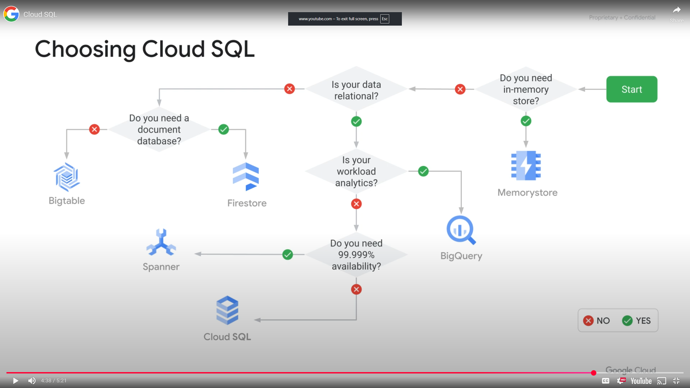

<h1>Storage and Database Services</h1>

<h2>Module Overview</h2>

<h2>Cloud Storage</h2>

Is an Object Storage service, using buckets that you place objects into. You can create directories but not easily index all the files like a file system. You use specific URL to access objects.

Use cases:
* Web content
* Storing data for archiving and disaster recovery
* Distributing large data objects to users via direct download

Key features
* Scalable to exabytes
* Time to first byte in milliseconds
* Very high availability across all storage classes
* Single API across storage classes

<h3>Storage Classes</h3>
Durability of all classes 99.999999999%
<h4>Standard</h4>

* Hot data and/or stored for only a brief periods of time like data intensive computations
* No minimum storage duration
* No retrieval cost
* Availability SLA 99.95% (multi/dual), 99.90% (regional)

<h4>Nearline</h4>

* Infrequently accessed data like data backup, long tail multimedia content and data archiving
* 30 days minimum
* Retrieval $0.01 per GB
* Availability SLA 99.90% (multi/dual), 99.00% (regional)

<h4>Coldline</h4>

* Infrequently accessed data that you read or modify at most once a quarter
* 90 days minimum
* Retrieval $0.02 per GB
* Availability SLA 99.90% (multi/dual), 99.00% (regional)

<h4>Archive</h4>

* Data archiving, online backup and disaster recovery. Data available in milliseconds
* 365 days minimum
* Retrieval $0.05 per GB
* No availability SLA

<h3>Overview</h3>
<h4>Buckets</h4>

* Naming requirements, must have a globally unique name
* Cannot be nested

<h4>Objects</h4>

* Inherit the storage class of bucket when they are created, data can be of any type
* No minimum size; unlimited storage

<h4>Access</h4>

* `gcloud storage` command
* RESTful JSON API or XML API

<h3>Changing Default Storage Classes</h3>

* Default class is applied to new objects
* Regional bucket can never be changed to Multi-Region/Dual-Region or vice versa
* Objects can be moved from bucket to bucket
* Object Lifecycle Management can manage the classes of objects
* Can change the storage class of an object that already exists without moving it.

<h3>Access Control</h3>

* **IAM** to control which individual user or service account can see, list objects, view names, or create new buckets
* **ACLs** offer finer control
* **Signed URL** provide a cryptographic key that gives time limited access to a bucket or object
* **Signed Policy Document** finer control than Signed URL, determines what kind of file can be uploaded by someone with a Signed URL

<h3>Access Control Lists (ACL)</h3>

Used to define who has access to the buckets and objects and what level of access they have. Maximum number of ACL entries for a bucket or object is 100.

**Scope** defines who can perform specified actions

**Permission** defines what actions can be performed

<h3>Signed URL</h3>

* "Valet key" access to buckets and objects via ticket:
  * Ticket is a cryptographically signed URL
  * Time limited
  * Operations specified in ticket: HTTP GET, PUT, DELETE (not POST)
  * Any user with URL can invoke permitted operations

<h2>Cloud Storage Features</h2>

* Customer supplied encryption key (CSEK) - Use your own key instead of Google managed keys
* Object Lifecycle Management - Automatically delete or archive objects
* Object Versioning - Maintain multiple versions of objects
* Directory Synchronization - Synchronizes a VM directory with a bucket
* Object change notifications using Pub/Sub
* Autoclass

<h3>Object Versioning</h3>

Object Versioning supports the retrieval of objects that are deleted or overwritten. Can be enabled on a bucket. 

* Objects are immutable - unchangable
* Object versioning:
  * Maintain a history of modifications of objects
  * List archived versions od an object, restore an object to an older state or delete a version

 <h3>Soft Delete</h3>
 Google recommends to use Soft Delete instead of Object Versioning to protect against permanent data loss from accidental or malicious deletions.

 * Provides default bucket level protection from 
   * Accidental deletion
   * Malicious deletion
* retains overwritten or changed data
* Is enabled by default with a 7 day retention duration. Can be configured to 0-90 days.

<h3>Object Life Management</h3>

Policies specify actions to be performed on objects that meet certain rules.
* Assign a lifecycle management configuration to a bucket
* Object inspection occurs in asynchronous batches, so rules may not be implied immediately
* Changes can take 24 hours to apply
* Example use cases
  * Downgrade storage classes on objects older than a year
  * Dele objects created before a specific date
  * Keep only the last 3 most recent versions of an object

<h3>Object Retention Lock</h3>

* Lets you define data retention requirements on a per object basis
* Retention configuration governs how long the object ust be retained, has the option to permanently prevent the retention time from being reduced or removed
* Helps with regulatory and compliance requirements and provides Google Cloud immutable storage solutions

<h3>Data Import Services</h3>

* **Transfer Appliance** rack, capture then ship your data to Google Cloud. Securely migrate large volumes of data (100s of TB up to 1 PB) without disrupting business operations
* **Storage Transfer Service** Import online data (another bucket, S3 bucket, or web source)
* **Offline Media Import** Third party provider uploads the data from physical media for you

<h3>Global Consistency</h3>
Cloud storage provides strong global consistency.

* Read after write
* Read after metadata update
* Read after delete
* Bucket listing
* Object listing

<h2>Choosing a Storage Class</h2>

Choose a region that helps optimize latency and network bandwidth.

* **Dual region** similar performance advantages as regions, but also higher availability being geo redundant.
* **Multi region** serve content to data consumers that are outside the Google network and distributed across large geographic areas, higher data availability due to geo redundant

<h3>Autoclass</h3>
Autoclass automatically transitions objects in your buckets to appropriate storage classes based on the access pattern of each object to reduce costs. All objects will start in standard storage unless specified. When Autoclass is enabled, there is no early deletion charges, no retrieval charges and no charge for storage class transitions

<h2>Filestore</h2>

A managed file storage service for applications
* Fully managed network attached storage (NAS) for COmpute Engine and GKE instances
* Predictable performance
* Full NFSv3 support
* Scales to 100s of TB for high performance workloads

<h3>Use Cases</h3>

* Application migration
* Media rendering, enables visual effects artists to collaborate on the same file share
* Electronic Design Automation (EDA), data management in batch workloads
* Data analytics - Compute complex financial models or analysis of environmental data
* Genomics processing - requires incredible amount of raw data, speed, scalability and security
* Web content management - manage and serve web content

<h2>Cloud Storage</h2>
<h3>Intro</h3>

Create buckets, set access control lists, manage encryption keys, enable object versioning, configure life cycle management, use directory synchronization feature.

<H3>Review</H3>

Working with buckets and objects in Cloud Storage
* CSEK: Customer supplied encryption key
* Use your own encryption keys
* Rotate keys
* ACL: Access Control List
* Set an ACL for private, and modify to public
* Lifecycle management
* Set policy to delete objects after 31 days
* Versioning
* Create a version and restore a previous version
* Directory synchronize a VM directory with a bucket

<h2>Cloud SQL</h2>

Cloud SQl is a fully managed database service (MySQL, PostgreSQL, Microsoft SQL Server)
* Patches and updates automatically applied
* You administer MySQL users
* Cloud SQL supports many clients
  * gcloud sql
  * App Engine, Google Workspace scripts
  * Applications and tools
    * SQL Workbench, Toad
    * External applications using standard MySQL drivers

<h3>Cloud SQL Instances</h3>

Performance
* 64TB of storage
* 60,000 IOPS
* 624GB RAM
* Scale out with read replicas

Choice:
* MySQL 5.6 or 8.0(default)
* PostgreSQL 9.6, 10, 11, 12, 13, 14, 15 (default)
* Microsoft SQL Server 2017, 2019 (default)

<h3>Cloud SQL Services</h3>

* High Availability configuration - within a regional instance there is a primary instance and a standby instance providing failover
* Backup service - automated and on demand with point in time recovery
* Import/export - with mysqldump or CSV files
* Scaling 
  * Up: machine capacity
  * Out: Read replicas

* **Memorystore** fully managed in memory data store service for workloads requiring microsecond response times or large spikes in traffic such as gaming environments and real time analytics
* **BigQuery** relational data primary for analytics but  no in memory data store. A data warehousing service that allows the storage of huge data sets while making them immediately processable without having to extract or run the processing in a separate service.
* **Spanner/Cloud SQL** relational data but not analytics
* **CLoud SQL** cost effective but no horizontal scaling or globally availability

<h2>Implementing Cloud SQL</h2>
<h3>Intro</h3>

Configure a Cloud SQL server and connect an application via a proxy over an external connection. Configure a connection of a private IP link offering performance and security benefits

<H3>Review</H3>

* Create a CLoud SQL database
* Configure it to use both an external connection over a secure proxy and a private IP address

* **NOTE:** can only connect vis private IP if the application and the Cloud SQL Server are collocated int eh same region and are part of the same VPC network. If your application is hosted in another region, VPC or project, use a proxy to secure its connection over the external connection.

<h2>Spanner</h2>

Spanner combines the benefits of relational database structure with non relational horizontal scalability.
* Scale to petabytes
* Strong consistency
* High availability
* Used for financial and inventory applications
* Monthly uptime
  * Multi-regional 99.999%
  * Regional 99.99%
* Schema
* SQL
* Replication is automatic
* Provides ACID (Atomicity, Consistency, Isolation, Durability)

<h3>Spanner Architecture</h3>
A spanner instance replicates data in N cloud zones which can be within one region or across several regions of your choosing. Data replication is synchronized across zones using Google's global fiber network.

Choose Spanner if you have outgrown any relational database, are sharding your databases for throughput high performance, need transactional consistency, global data and strong consistency or just want to consolidate your database.

<h2>AlloyDB</h2>

Alloy DB for PostgreSQL is a fully managed, PostgreSQL compatible database service that is designed for demanding workloads such aas hybrid transactional and analytical processing.
* Fully managed database service - automates administrative tasks like back ups, replication, patching and capacity management, uses adaptive algorithms and machine learning for PostgreSQL vacuum management, storage and memory management, data tiering and analytics acceleration
* Fast transactional processing - 4 times faster than standard PostgreSQL, suitable for demanding enterprise workloads that require high transaction throughput, large data sizes or multiple read write replicas
* High availability and 99.99 uptimeSLA, inclusive of maintenance
* Real time business insights up to 100 times faster than PostgreSQL for analytical queries
* Built in Vertex AI

<h2>Firestore</h2>

Firestore is a fast, fully managed, serverless, cloud native, NoSQL document database.
* Simplifies storing, syncing and querying data
* Mobile, web and IoT apps at a global scale
* KLive synchronization and offline support
* Security features
* ACID transactions
* Multi-region replication
* Powerful query engine

<h3>Firestore is the Next Generation of Datastore</h3>

**Datastore mode** (new server projects)
* COmpatible with Datastore applications
* Strong consistency
* No entity group limits

**Native mode** (new mobile and web apps)
* Strongly consistent storage layer
* Collection and document data model
* Real time updates
* Mobile and web client libraries

If your schema might change and you need an adaptable database, you need to scale to zero or you want low maintenance overhead scaling up to TB, consider using Firestore.

<h2>Bigtable</h2>

Bigtable is a NoSQl big data database service
* Petabyte scale
* Consistent sub-10ms latency
* Seamless scalability for throughput
* Learns and adjusts to access patterns
* Ideal for Ad Tech, Fintech and IoT - is used for many of Google's core services including Search, Analytics, Maps and Gmail
* Storage engine for ML applications
* easy integration with open source big data tools such as Hadoop Dataflow and Dataproc
* Supports open source industry standard HBase API

<h3>Bigtable Storage Model</h3>

Bigtable stores data in massively scalable tables, each of which is a sorted key/value map. The table is composed of **rows**, each which typically describes a single entity, and **columns**, which contain individual values for each row. Each row is indexed be a single **row key** and columns that are related to one another are typically grouped together into a **column family**.  Each column is identified by a combination of the column family and a **column qualifier**, which is a unique name within the column family. Each row/column intersection can contain multiple cells or versions, at different time stamps, providing a record of how the stored data has been altered over time.  Bigtable tables are sparse, if the cell does not contain any data, it does not take up any space.

Processing is done through a front end server pool and nodes, is handled separately from the storage. A Bigtable table is sharded into blocks of contiguous rows,called **tablets** to help balance the workloads of queries. Tablets are similar to HBase regions and are stored on Colossus, Googles file system in SStable format. **SSTable** provides a persistent, ordered immutable map from keys to values, where both keys and values are arbitrary byte strings.

If you need to store more than 1TB of structured data, have hig volume of writes, need read/write latency of less than 100 milliseconds along with strong consistency or need a storage system that is compatible with HBase API, consider using Bigtable.

<h2>Memorystore</h2>

Memorystore is a fully managed Redis service
* In memory data store, scalable, secure
* Focus on building great apps
* High availability (99.9% availability SLA, replicated across two zones), failover, patching and monitoring
* Sub-millisecond latency
* Instances up ot 300 GB
* Network throughput of 12Gbps
* Easy lift and shift

<h2>Module Review</h2>

Storage and Database services
* Cloud Storage a fully managed object store
* Filestore a fully managed file storage service
* Cloud SQL a fully managed MySQL and PostgreSQL database
* Spanner a relational database service with transactional consistency, global scale and high availability
* AlloyDB a fully managed PostgreSQL compatible database service
* Firestore a fully managed NoSQL document database
* Bigtable a fully managed NoSQL wide column database
* Memorystore a fully managed in memory datastore service for Redis

