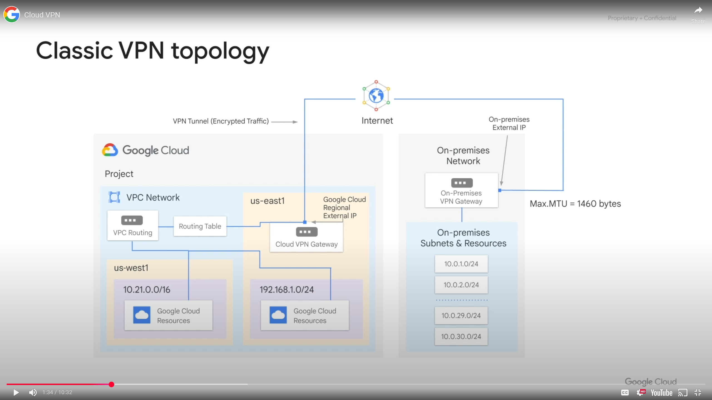
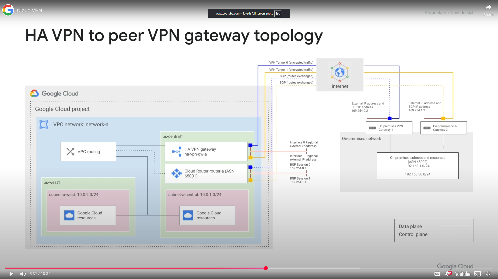
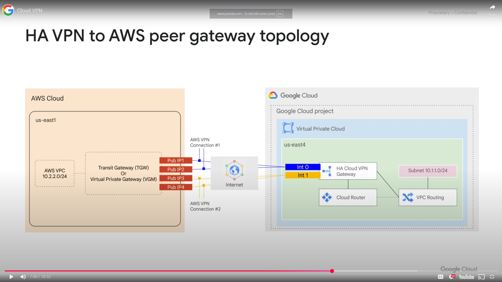
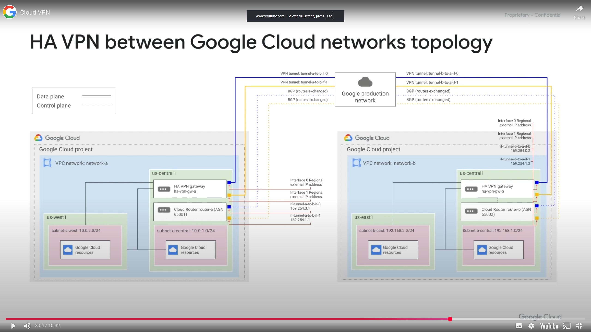
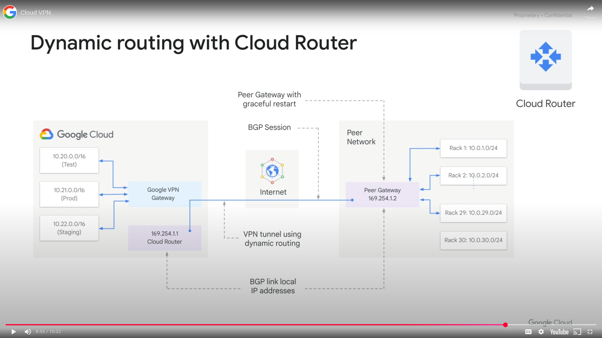
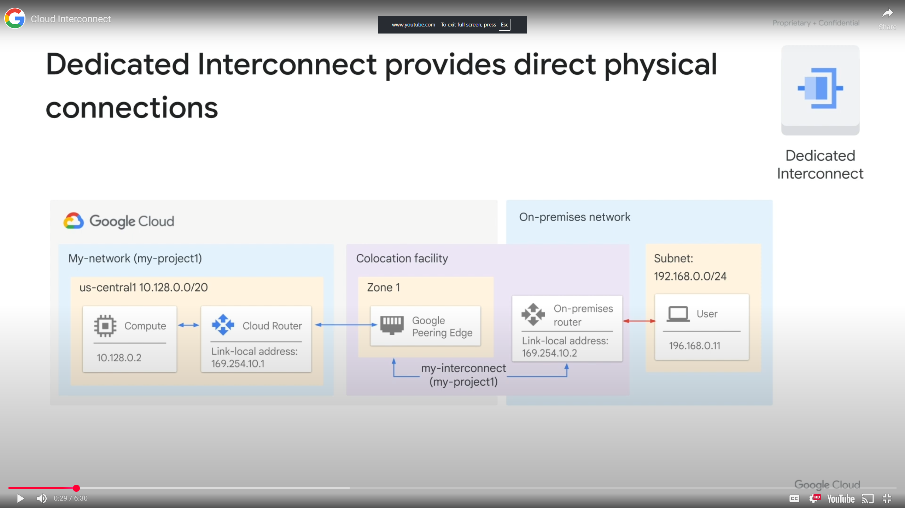
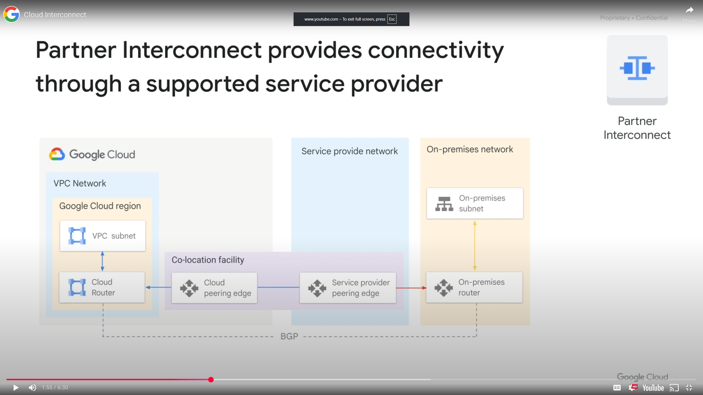

<h1>Interconnecting Networks</h1>
<h2>Module Overview</h2>

Different applications and workloads require different network connectivity solutions.
* Cloud VPN
* Cloud Interconnect
* Peering
* Sharing VPC networks

<h2>Cloud VPN</h2>

Google Cloud offers to types of Cloud VPN gateways HA VPN and Classic VPN. All Cloud VPN gateways created before the introduction of High Availability (HA) VPN are considered Classic VPN gateways. 

<h3>Classic VPN</h3> securely connects your on premises network to your Cloud VPC network through an IP sec VPN tunnel. Traffic traveling between the two networks is encrypted by one VPN gateway and decrypted by the other VPN gateway.
* Useful for low volume data connections
* 99.9 SLA
* Supports
  * Site to site VPN
  * Static routes
  * Dynamic routes (Cloud Router)
  * IKEv1 and IKEv2 ciphers
* Classic VPN does not support use cases where clients computers need to dial in to a VPN using client VPN software

* The resources are able to communicate using their internal IP addresses due to routing within a network is automatically configured, assuming firewall rules allow it.
* Need to configure the Cloud VPN gateway, on premises VPN gateway and two VPN tunnels
* Maximum transmission unit (MTU) for your on premises VPN gateway cannot exceed 1460 bytes because of encryption and encapsulation of packets

<h3>HA VPN</h3>

High availability Cloud VPN solution to securely connect to your on premises network to your VPC network through an IPsec VPN connection in a single region
* Provides 99.99% SLA, provided you properly configure 2 or 4 tunnels from your HA VPN gateway to your peer VPN gateway or another HA VPN gateway
* Google Cloud automatically chooses 2 external IP addresses one for each of its fixed number of 2 interfaces
  * Supports multiple tunnels
  * VPN tunnels connected to HA VPN gateways must use dynamic (BGP) routing
* Supports site to site VPN for different topologies/configuration scenarios (active/active or active/passive routing)
  * An HA VPN gateway to peer VPN devices
  * An HA VPN gateway to an AWS virtual private gateway
  * Two HA VPN gateways connected to each other

3 typical peer gateway configurations for HA VPN
* HA VPN gateway to 2 separate peer VPN devices each with its own IP address
* HA VPN gateway to one peer VPN device that uses 2 separate IP address
* HA VPN to one peer VPN device that uses 1 IP address

In the above example one HA VPN gateway connects to 2 peer devices
* Each peer device has one interface and one external IP address
* HA VPN gateway uses two tunnels, one to each device. If your peer side gateway is hardware based, having a second peer sided gateway provides redundancy and failover. A second physical gateway lets you take one of the gateways offline for software upgrades or maintenance
* Redundancy type for this configuration takes the value two_IPS_redundancy

* can use either a transit gateway or a virtual private gateway. Only the transit gateway supports equal cost multipath (EMCP) routing. When it is enabled, it equally distributes traffic across active tunnels
* 3 major gateway components
  * HA VPN gateway in Google Cloud with 2 interfaces
  * 2 AWS virtual private gateways which connect to your HA VPN gateway
  * External VPN gateway resource in Google Cloud that represents your AWS virtual private gateway
* Uses 4 tunnels. 2 tunnels from one AWS virtual private gateway to one interface of the HA VPN gateway. Another 2 tunnels from the other AWS  private gateway to the other interface of the HA VPN gateway

* You can connect two Google Cloud VPC networks together by using an HA VPN gateway in each network
* Create 2 tunnels

<h3>Dynamic Routing with Cloud Routing</h3>

Can manage routes for a Cloud VPN tunnel using Border Gateway Protocol (BGP), which allows for routes to be updated and exchanged without changing the tunnel configuration.

* 2 different regional subnets in a VPC network
* On premises network has 29 subnets and the 2 networks are connected through Cloud VPN tunnels

<h2>Configuring Google Cloud HA VPN</h2>
<h3>Intro</h3>

* Create 2 VPC networks and instances
* Configure HA VPN gateways
* Configure dynamic routing with VPN tunnels
* Configure global dynamic routing mode
* Verify and test HA VPN gateway configurations

<h2>Cloud Interconnect and Peering</h2>

* Direct Peering - Dedicated, layer 3
* Carrier Peering - Shared, layer 3
* Dedicated Interconnect - Dedicated, layer 2
* Partner Interconnect - Shared, layer 2 and 3

**Dedicated** connections provide a direct connection to Google's network. **Shared** connections provide a connection to Google's network through a partner.

**Layer2** connection use a VLAN that pipes directly into your GCP environment, providing connectivity to internal IP addresses in the RFC 1918 address space. **Layer 3** connections provide access to Google Workspace services, YouTube and Google Cloud APIs using public IP addresses.

**Cloud VPN** uses the public internet but traffic is encrypted and provides access to internal IP addresses, making it a useful addition to Direct Peering and Carrier Peering

<h2>Cloud Interconnect</h2>

<h3>Dedicated Interconnect</h3>

Provides direct physical connections between your on premises network to Google's network, enabling you to transfer large amounts of data between networks making it more cost effective than purchasing additional bandwidth over the public internet.

* To use Dedicated Interconnect you need to provision a cross connect between the Google network and your own router in a common colocation. Then to exchange routes between the networks, you configure a BGP session over the interconnect between the CLoud Router and the on premises router, allowing user traffic from on premises network to reach GCP resources and vice versa.
* 99.9% or 99.99% SLA depending on configuration
* Your network must meet Google's network in a supported colocation facility

<h3>Partner Interconnect</h3>

Provides connectivity through a supported service provider. Useful if your data center is in a physical location that cannot reach a Dedicated Interconnect colocation facility or your data needs don't warrant a Dedicated Interconnect. THe service providers have an existing physical connections with Google's network that is available for their customers to use. After establishing connectivity with a service provider, you can request a Partner Interconnect connection, then establish a BGP session between your Cloud Router and your on premises router to start passing traffic between networks.
* 99.9% or 99.99% SLA depending on configuration

<h3>Cross Cloud Interconnect</h3>

* Establish high bandwidth dedicated connectivity between Google Cloud and another cloud service provider (AWS, Microsoft Azure, Oracle Cloud Infrastructure, Alibaba Cloud)
* Supports the adoption of an integrated multi cloud strategy, offers reduced complexity, site to site data transfer and encryption
* Two connection sizes: 10 or 100 Gbps
* Identify supported locations where you want Google to place your connections, purchase primary and redundant Cross Cloud Interconnect ports, provision the connection. Google supports the connection up to the point where it reaches the network of the other cloud service provider

<h3>Interconnect Options</h3>

All accessed via internal IP addresses

**VPN tunnel**
* Encrypted tunnel to VPC networks through the public internet
* 1.5-3Gbps per tunnel
* Remove VPN gateway

**Dedicated Interconnect**
* Dedicated, direct connection to VPC networks
* 10 or 100 Gbps per link
* Connection in colocation facility

**Partner Interconnect**
* Dedicated bandwidth, connection to VPC network through a service provider
* 50 Mbps - 50 Gbps per connection
* Service provider

**Cross Cloud Interconnect**
* Dedicated physical connection between VPC network and network hosted by service provider
* 10 or 100 Gbps per connection
* Primary and redundant ports (Google Cloud and remote cloud service provider)

<h2>Peering</h2>

<h2>Choosing a Connection</h2>

<h2>Shared VPN and VPC Peering</h2>

<h2>Module Review</h2>

