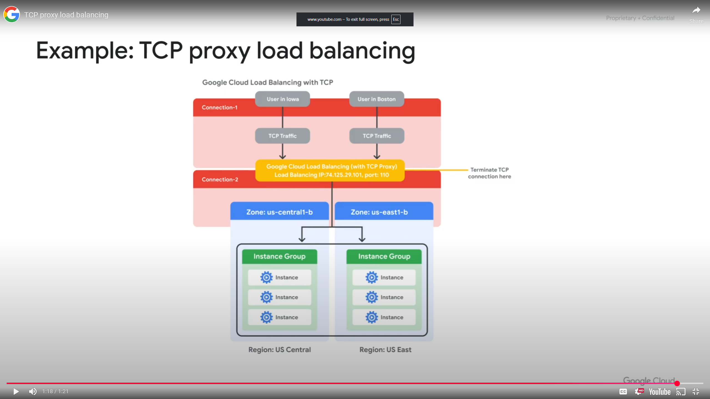
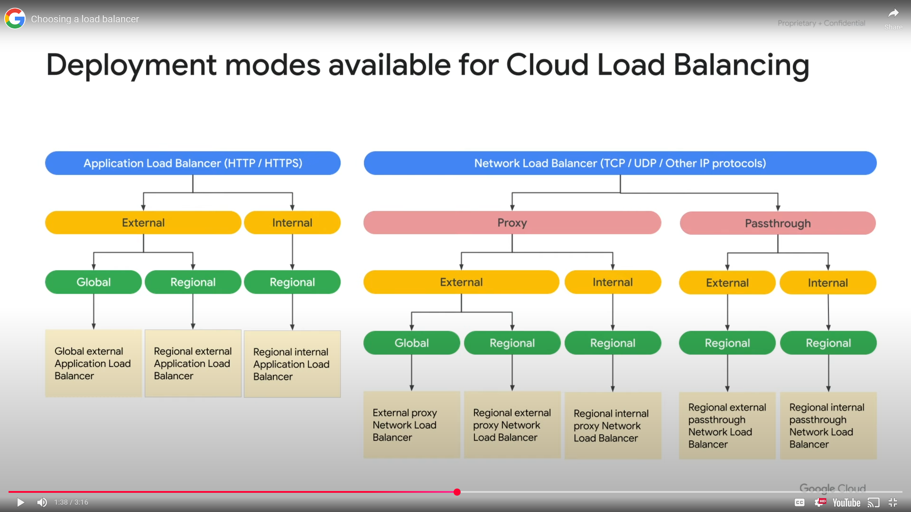
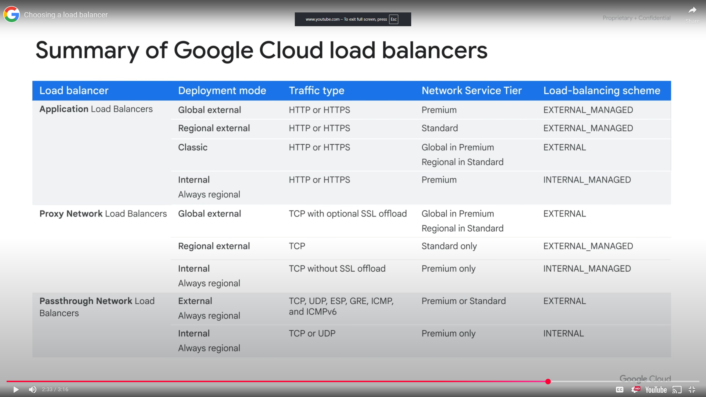

<h1>Load Balancing and Autoscaling</h1>
<h2>Module Overview</h2>

* Fully distributed, software defined, managed service
* Distribute load balanced compute resources in single or multiple regions to meet your high availability requirements
* Put your resources behind a single anycast IP address
* Scale resources up or down with intelligent autoscaling
* Serve content as close to possible  to users

<h3>Global Load Balancers</h3>

These load balancers leverage Google frontends, which are software defined, distributed systems on Googles Points of Presence. Use a global load balancer if your users and instances are distributed globally, users need access to the same applications and content and you want to provide access using a single anycast IP address

* Global External HTTP(S) Load Balancing
* External HTTP(S) Load Balancing (classic)
* External SSL Proxy Load Balancing
* external TCP Proxy Load Balancing

<h3>Regional Load Balancers</h3>

Internal and network load balancers distribute traffic to instances that are in a single region. Load balancers uses Andromeda, Google's software defined network virtualization stack. Network load balancers use Maglev. a large distributed software system

* Regional External HTTP(S) Load Balancing
* Internal HTTP(S) Load Balancing - proxy based, regional Layer 7, enabling you to run and scale services behind a private load balancing IP address that is only accessible in the load balancers region of your VPC network.
* Internal TCP Proxy Load Balancing
* Internal TCP/UDP Load Balancing
* External TCP/UDP Network Load Balancing
* External Regional TCP Proxy Load Balancing

**Modules**
* Managed Instance Groups
* HTTP(S) Load Balancing
* Cloud CDN
* SSL Proxy/TCP Proxy Load Balancing
* Network Load Balancing
* Internal Load Balancing
* Choosing a Load Balancer

<h2>Managed Instance Groups</h2>

* Deploy identical instances based on instance template
* Instance group can be resized
* Manager ensures all instances are running
* Typically used with autoscaler
* Can be single zone or regional (recommended for zonal failures)

<h3>Creating Managed Instance Groups</h3>

* Create an instance template
* Create a managed instance group of N specified instances
  * Type - stateless (batch, website frontend, image processing), stateful (database, legacy applications)
  * Name
  * Location - single zone, multi zone, location of zone, port mapping details
  * Instance template being used
  * Autoscaling options
  * Health check options
* the instance group manager then automatically populates the instance group based on the template

<h2>Autoscaling and Health Checks</h2>

Managed instance groups offer autoscaling capabilities.

Dynamically add/remove instances
* Increase load
* Decrease load

Autoscaling policy
* CPU utilization
* Load balancing capacity
* Monitoring metrics
* Queue-based workload
* Schedule based workload

VM graphs help set CPU utilization and useful for monitoring instances utilization for determining how best to configure the autoscaling policy to meet changing demand. If this is being monitored through Cloud Monitoring, alerts and notifications can be received.

<h3>Health Checks</h3>

Similar to a uptime check in Cloud Monitoring. Define a protocol, port, and health criteria:
* Check interval - how often to check if an instance is healthy
* Timeout - how long to wait for a response
* Healthy Threshold - how many successful attempts are decisive
* Unhealthy Threshold - how many failed attempts are decisive

<h3> Configuring Stateful IP Addresses</h3>

Preserve the unique state of each Managed Instance Group (MIG) VM instance on machine restart, recreation, auto-healing or update event.
* IP addresses to remain static after it has been assigned
* Configuration depends on specific IP addresses
* Server is accessed through a dedicated static IP address
* Migrate workloads without changing network configuration
* Configure IP addresses as stateful for all existing and future instances in the group
* Update the existing stateful configuration for IP addresses

<h2>Overview of HTTP(S) Load Balancing</h2>

Acts at Layer 7 of the OSI model, the application layer, dealing with the actual content of each message allowing routing decisions based on the URL.

<h3>HTTP(S) Load Balancing</h3>

* Global load balancing for requests destined for your instances
* Anycast IP address - simplifies DNS setup
* Balances traffic across multiple back end instances and multiple regions
* HTTP or port 80 or 8080
* HTTPS on port 443
* IPv4 or IPv6, content based, cross regional
* Autoscaling
* URL maps, generally requests are routed to the closest to the user that has capacity

<h3>Architecture of an HTTP(S) Load Balancer</h3>

<h3>Backend Services</h3>

* Health check
* Session affinity (optional)
* Timeout setting (30 sec default)
* One or more backends
  * An instance group (managed or unmanaged)
  * A balancing mode (CPU utilization or RPS), determines when the backend is at full usage
  * A capacity scaler (ceiling percentage of CPU/Rate targets)

<h2>Example: HTTP Load Balancer</h2>

* Single global IP address accessed from two locations - North America and EMEA
* Global forwarding rule directs incoming requests to the target HTTP proxy
* Proxy checks the URL map to determine appropriate backend service for the request
* Backend service has 2 backends, each consisting of a managed instance group
* When a user request comes in the load balancing service determines the approximate location of the request from the source IP, then depending on the locations of the instances, overall capacity, overall current usage, decides where the user is directed.

**Cross Region Load Balancing** can occur when the instance closest to the user is unable to take the users request and sends them to an instance that is not in their closest region.

<h2>HTTP(S) Load Balancer</h2>

An HTTP(S) load balancer has the same basic structure as an HTTP load balancer but differs in the following ways:
* Target HTTP(S) proxy
* One signed SSL certificate installed (minimum)
* Client SSL session terminates at the load balancer
* Support the QUIC transport layer protocol 
**QUIC** is a transport layer protocol that allows for faster client connection initiation, eliminates head of line blocking in multiplexed streams and supports connection migration when a clients IP address changes.

<h3>SSL Certificate</h3>

* Required for HTTP(S) load balancing
* Up to 15 SSL certificates (per target proxy)
* Create an SSL certificate resource, used only with load balancing proxies

<h3>Backend Bucket</h3>

Backend buckets allow you to use Google Cloud Storage buckets with HTTP(S) load balancing. An external HTTP(S) load balancer uses a URL map to direct traffic from specified URLs to either a backend service or backend bucket. Eg requests for dynamic content in one bucket and static in another

<h3>Network Endpoint Group (NEG)</h3>

A network endpoint group (NEG) is a configuration object that specifies a group of backend endpoints or services.

* Common use case for this configuration
  * Deploying services in containers
  * Distribute traffic in a granular fashion to applications running on your backend instances
  * Backends for some load balancers with Traffic Director
* 4 types of NEGs - define how endpoints should be reached, whether they are reachable, where they are located
  * Zonal - contains one or more endpoints that can be Compute Engine VMs or services running on the VMs. each endpoint is specified by either an IP address or an IP:port combination
  * Internet - contains a single endpoint that is hosted outside of Google Cloud, specified by hostname FQDN:port or IP:port
  * Hybrid connectivity - points to traffic Director services running outside of Google Cloud
  * Serverless - don't contain endpoints, points to Cloud Run, App Engine, Cloud Functions services in the same region as the NEG

<h2>Configuring an HTTP Load Balancer with Autoscaling</h2>
<h3>Intro</h3>

* Create HTTP and health check firewall rules
* Create a custom image for a web server
* Create an instance template based on the custom image
* Create two managed instance groups
* Configure an HTTP load balancer with IPv4 and IPv6
* Stress test an HTTP load balancer

<h3>Review</h3>

Configured an Application Load Balancer with backends in 2 regions. Then stress tested the Application Load Balancer with a VM to demonstrate global load balancing and autoscaling.

<h2>Cloud CDN</h2>

Cloud Content Delivery Network (CDN) uses Google's globally distributed edge points of presence (90 locations) to cache HTTP(S) load balanced content close to your users, providing faster delivery and reducing serving costs.

**Cache Miss** when a system or application makes a request to retrieve data from a cache but that specific data is not currently in the cache. THe cache then attempts to retrieve the data from a nearby cache or the load balancer.

**Cache Hit** when the data requested is already in the cache from a previous users request. The cache is able to serve the content and shortens the time it takes to request from the origin server/instance.

Each Cloud CDN request is automatically logged within Google Cloud, the logs indicate a cache miss or cache hit for each HTTP request of the load balancer.

<h3>Cloud CDN Cache Modes</h3>

Cache modes control the factors that determine whether or not Cloud CDN caches your content. these modes define how responses are cached, whether to not Cloud CDN respects cache directives sent by the origin and how cache TTls are applied. Three modes are
* `USE_ORIGIN_HEADERS` requires origin responses to set valid cache directives and valid caching headers
* `CACHE_ALL_STATIC` automatically caches static content that doesn't have the no-store, private or no-cache directive
* `FORCE_CACHE_ALL` unconditionally caches responses, overriding any cache directives set by the origin

**NOTE**: make sure not to cache private, per users content (such as dynamic HTML or API responses) if using a shared backend with the force cache all mode configured.

<h2>SSL Proxy Load Balancing</h2>

* Global load balancing for encrypted, non HTTP traffic
* Terminates SSL session at load balancing layer, then balances the connections across the instances (across regions if necessary) using the SSL or TCP protocols
* IPv4 or IPv6 addresses for client traffic
* Benefits:
  * Intelligent routing - load balancer can route requests to backend locations where there is capacity
  * Certificate management - only need to update your customer facing certificate in one place, reduce management overhead by using self signing certificates
  * Security patching - GCP applies patches at the load balancer automatically
  * SSL policies

  

<h2>TCP Proxy Load Balancing</h2>

* A global load balancing service for unencrypted, non HTTP traffic
* Terminates TCP sessions at load balancing layer, then forwards the traffic to your VM instances using TCP or SSL
* IPv4 or IPv6 clients
* Intelligent routing
* Security patching

<h2>Network Load Balancing</h2>

* Regional, non-proxied load balancer. all traffic is passed through the load balancer instead of being proxies and the traffic can only be balanced between VM instances that are in the same region
* Forwarding rules based on the incoming IP protocol data eg address, port or protocol type
* Traffic: UDP, TCP/SSL ports that are not supported with the TCP proxy and SSL proxy load balancers
* Architecture: Backend service based, target pool based

<h3>Backend Service Based Architecture</h3>

* Regional backend service
* Defines the behavior of the load balancer and how it distributes traffic to its backend instance groups
* Enables new features not supported with legacy target pools
  * Non-legacy health checks
  * Auto-scaling with managed instance groups (TCP, SSL, HTTP, HTTPS, HTTP/2)
  * Connection draining
  * Configurable failover policy

<h3>Target Pool Based Architecture</h3>

Defines a group of instances that receive incoming traffic from forwarding rules. The forwarding rule directs traffic to a target pool, the load balancer pick an instance from these target pool based on a hash of the source IP and port and the destination IP and port.
* Forwarding rules (TCP and UDP)
* Up to 50 target pools
* One health check
* Instances must be in the same region

<h2>Internal Load Balancing</h2>

This load balancer enables you to run and scale services behind a private load balancing IP address
* Regional, private load balancing
  * VM instances in same region, internal IP address
  * RFC1918 IP addresses
* TCP/UDP traffic
* Reduced latency, simpler configuration
* Software defined, full distributed load balancing
* Built on top of Andromeda, delivers traffic from the client instance to a back end instance
* Supports 3 tier web services

<h3>Internal HTTP(S) Load Balancing</h3>

* Regional, private load balancing
  * VM instances in same region
  * RFC 1918 IP addresses
* HTTP, HTTPS or HTTP/2 protocols
* Based on open source Envoy proxy

<h2>Configure an Internal Network Load Balancer</h2>
<h3>Intro</h3>

* Create HTTP and health check firewall rules
* Configure 2 instance templates
* Create 2 managed instance groups
* Configure and test an internal load balancer

<h3>Review</h3>

Created 2 managed instance groups in the US central 1 region, with firewall rules to allow HTTP traffic to those instances and TCP traffic from the GCP health checker. Configured and tested an internal load balancer for the instance groups.

<h2>Choosing a Load Balancer</h2>

<h3>IPv6 support</h3>

* HTTP(S), SSL proxy, TCP proxy load balancers
* The load balancer acts as a reverse proxy, terminates the IPv6 client connection and places the request into an IPv4 connection to a backend. On the reverse path, the load balancer receives teh IPv4 response from the backend and places it into the IPv6 connection back to the original client. Configuring IPv6 termination makes your backend instances appear as IPv6 applications to the IPv6 clients.

* Determine what traffic type you want to handle
* Application Load Balancer: flexible feature set for your applications with HTTP(S) traffic
* Proxy Network Load Balancer: implement TLS offload, TCP proxy, or support for external load balancing to backends in multiple regions
* Passthrough Network Load Balancer: preserve client source IP addresses, avoid overhead of proxies, support additional protocols (UDP, ESP, ICMP, UDP) or expose client IP address to applications
* Consider applications requirements of external or internal facing, backends global or regional

* MANAGED indicates it is implemented as a managed service either on Google front ends or on the open source Envoy proxy

<h2>Module review</h2>

* Different types of load balancers
* Managed instance groups
* Autoscaling
* Criteria in choosing a load balancer
* Useful to combine an internal and external load balancer to support 3 tier web services
