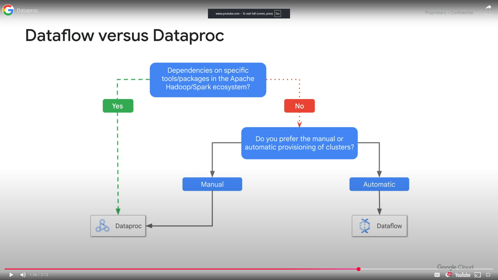

<h1>Managed Services</h1>
<h2>Module Overview</h2>

Managed Services are partial or complete solutions offered as a service. They exist on a continuum platform as a service and software as a service, depending  how much of the internal methods and controls are exposed. Using a managed service allows you to outsource the administrative and maintenance overhead to Google if your application requirements fits withing the service offering.

* BigQuery
* Dataflow
* Dataprep
* Dataproc

<h2>BigQuery</h2>

BigQuery is Google Cloud's serverless highly scalable and cost effective cloud data warehouse
* Fully managed
* Petabyte scale
* SQL interface, as there is no infrastructure to manage, so no need for a database administrator
* Very fast
* Access via Console, command line tool, rest API, third party tools to visualize data

<h2>Dataflow</h2>

Dataflow to execute a wide variety of data processing patterns
* Serverless, fully managed data processing
* Batch and stream processing with autoscale
* Open source programming using Apache beam
* Intelligently scale to millions of queries per second
* Tightly coupled with other Google services so can set up priority alerts and notifications to monitor your pipeline
* Used to transform data to analyze it in BigQuery, AI Platform, Bigtable

<h2>Dataprep</h2>

Dataprep an intelligent data service for visually exploring, cleaning and preparing structured and unstructured data for analysis reporting and machine learning.
* Serverless, works at any scale so no infrastructure to deploy or manage
* Suggests ideal data transformation, so don't have to write code
* Focus on data analysis as it has automatic schema, data types, possible joins and anomaly detection
* Integrated partner service operated by Trifacta
* Fully managed, scaled on demand
* Used before Dataflow to prepare raw data

<h2>Dataproc</h2>

Dataproc is a fast, easy to use, fully managed cloud service for running Apache Spark and Apache Hadoop clusters in a simpler way.
* Low cost (per second, preemptible)
* Super fast to start, scale and shut down
* Integrated with Google Cloud
* Managed service
* Simple and familiar

Dataflow and Dataproc have overlap in their batch and streaming capabilities. If you have dependencies on specific tools or packages in the APache Hadoop or Spark ecosystem use Cloud Dataproc. If you prefer a hands on or dev ops approach to operations use Dataproc. Use Dataflow for a hands off, serverless approach 

<h2>Demo: Dataproc</h2>

* Create a Cloud Dataproc cluster - master and workers
* Modify the number of workers in the cluster
* Submit a simple Apache Spark job

<h2>Module Review</h2>

Overview of managed services for data processing in GCP, BigQuery, Dataflow, Dataproc, Dataprep. Managed services allows you to outsource most of the administrative and maintenance overhead
