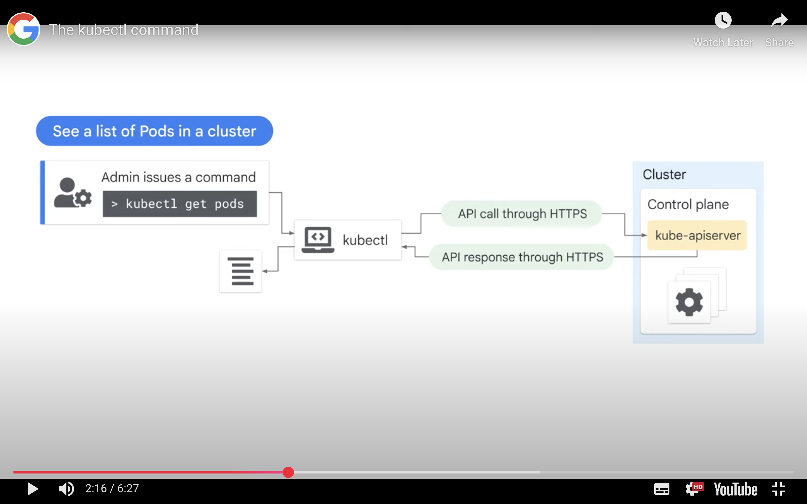

<h1>Kubernetes Operations</h1>
<h2>Introduction</h2>

<h3>kubectl</h3>

Command line tool that interacts with GKE clusters
* Easy to automate tasks
* Easy to troubleshoot problems

Modules
* Explore kubectl and how to configure it
* Explore what introspection means and how it can be used to troubleshoot a cluster
* Lab practicing deploying GKE clusters from Cloud Shell

<h2>The kubectl Command</h2>

* A utility used by administrators to control Kubernetes clusters. Used to communicate with KubeAPI server on the control plane.
* Important to users as it allows them to make requests to the cluster and kubectl determines which part of the control plane to communicate with
* Within a cluster, kubectl transforms commandline entries into API calls to send to eht Kube API server
* Kubectl must be configured with location and credentials of a Kubernetes cluster
* Creating, viewing and deleting Kubernetes objects
* Viewing or exporting configuration files
* *NOTE:* configure kubectl first and use the `--kubeconfig` or `--context parameters` so commands are performed on the cluster intended

<h3>Kubectl Configuration</h3>

* Store it's configuration file in the home directory in a hidden folder `$HOME/.kube/config.`
* Configuration files contains:
  * List of clusters
  * Credentials that will be attached to each
* GKE provides the credentials through the gcloud command
* View the configuration from the config file or through the kubectl command `config view`
* *NOTE:* kubectl config shows the configuration of the kubectl command itself, other kubectl commands show the configuration of clusters and workloads

<h3>Example of kubectl</h3>



<h3>Connecting kubectl to a GKE Cluster</h3>

* Retrieve credentials for the specified cluster with `get-credentials` command in gcloud or kubectl eg Cloud Shell. By default the gcloud `get-credentials` command writes configuration information into a config file in the kube directory in the $HOME directory. If the command is rerun for a different cluster, it'll update the config file with the credentials for the new cluster
```
gcloud container clusters \
get-credentials [CLUSTER_NAME] \
--region [REGION_NAME]
```
* Once the config file in the kube file is configured, kubectl command automatically references this file and connects the default cluster without prompting for credentials

<h3>kubectl Restrictions</h3>

* Can't create new clusters
* Can't change the shape of existing clusters
  * These are done with the GKE plane

<h3>Using kubectl Command</h3>

<h4>Command</h4>

* Specifies the action to perform: get, describe, logs, exec 
* Some show information,others change the clusters configuration

<h4>Type</h4>

* Defines the type of object the command acts upon: Pods, deployments, nodes, objects, clusters

<h4>Name</h4>

* Specifies the object defined in Type. Not always required, but can be used to filter

<h4>Flags</h4>

* Special requests: see state of Pods.
* Optional
* To display additional information

<h2>Introspection</h2>

Introspection is the act of gathering information about the containers, pods, services and other engines that run within the cluster.

<h3>kubectl Commands</h3>
<h4>Get</h4>

* `kubectl get pods` is the Pod running with the phase status
  * Pending - kubernetes has accepted a Pod but it is being scheduled
  * Running - successfully attached to a node and all its containers are created
  * Succeeded - all containers finished running successfully or instead they terminated successfully and won't be restarting
  * Failed - a container terminated with a failure and won't be restarting
  * Unknown - state of the Pod cannot be retrieved, possible communication error between the control plane and kubelet
  * Crash Loop Back Off - one of the containers in the Pod exited unexpectedly even after it was restarted at least once. Usually a configuration issue

<h4>Describe</h4>

* `kubectl describe pod [POD_NAME]` Provides information about a Pod and its containers
  * For Pods: name, namespace, node name, labels, status, IP address
  * For Containers: state (waiting, running, terminated), images, ports, commands, restart counts

<h4>Exec</h4>

* `kube exec [POD_NAME] -- [command]` Runs a single command inside a container and view results in your own command shell. Useful for pings

<h4>Logs</h4>

* `kubectl logs [POD_NAME]` to see what is happening inside a Pod. useful for troubleshooting as it can reveal errors or debugging messages
* `-c` argument to show logs for a specific container
* `stdout` Standard output on the console
* `stderr` Error messages

<h3>Running a Command Within a Pod</h3>

* `kubectl exec -it [POD_NAME] -- [command]` launches an interactive shell using the -it switch, connecting your shell to the container, allowing you to work inside the container
* `-i` argument tells kubectl to pass the terminals standard input to teh container
* `-t` argument tells kubectl that the input is a TTY

<h3>Best Practice</h3>

* It's not best practice to install software directly into a container
* Changes made by containers to their file systems are usually ephemeral
* Consider building container images that have exactly the software you need
* The interactive shell will allow you to figure out what needs to be changed
* Integrate those changes into your container images and redeploy them

<h2>Deploying GKE Autopilot Clusters from Cloud Shell</h2>
<h3>Intro</h3>

* Use command line to build GKE clusters
* Inspect the kubeconfig file
* Use kubectl to manipulate the cluster
